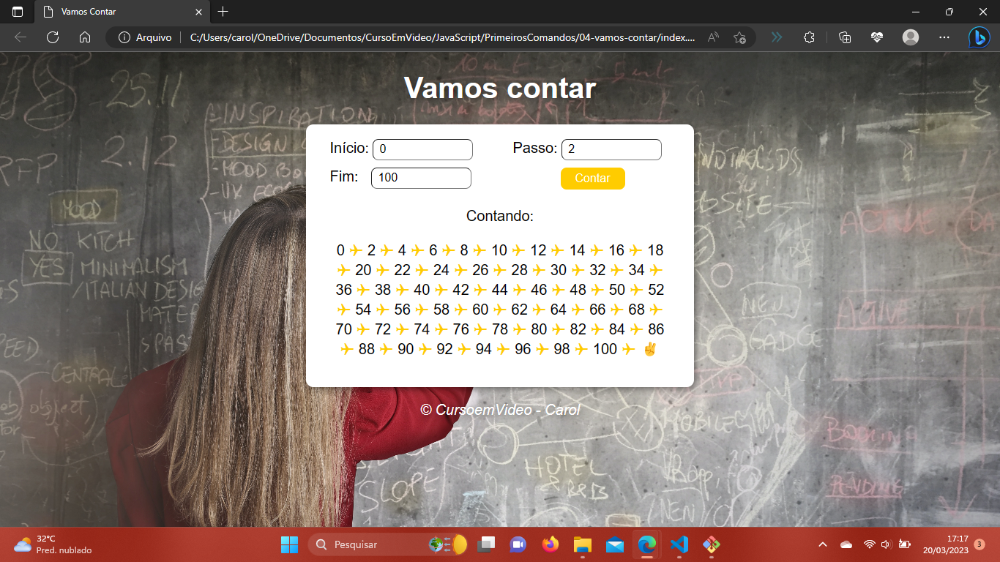

# Javascript - Curso em Vídeo

Nesse projeto eu resolvi todos os exercícios do curso básico de Javascript da plataforma Curso em Vídeo. Eu também fiz os meus próprios testes para reforçar o aprendizado, incluindo uma página inicial que reúne todos os projetos do curso. Abaixo estão os prints dos exercícios resolvidos.

## Hora do dia
--> Condições e manipulação de elementos do HTML pelo JS
  

## Verificador de idade
--> Condições e criação de elementos HTML pelo JS
  

## Contador
--> Estruturas de repetição
  

## Tabuada
--> Condições, estruturas de repetição e criação de elementos pelo JS
  

